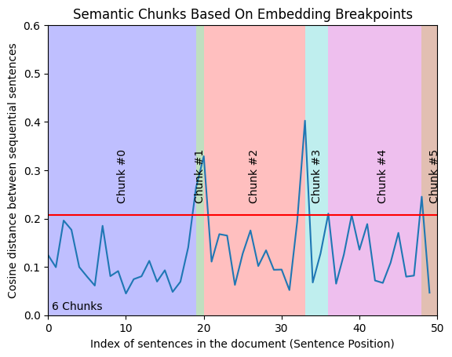

# Question Generation system. last Version 1.0

## How to start:
You can find the docker image of the system on:

docker pull paulbarreda9/backend0

Once you clone the image, you will need to change the SESSION_API_URL variable in the .env file. You need to replace it with the URL of your local ollama port. Very often is "http://127.0.0.1:11434".

After this, feel free to run: docker run -p 8000:8000 name_of_the_image


## Installation
- 1: Install Ollama
https://ollama.com/download

- 2: Start ollama and download llama3 8B
https://ollama.com/library/llama3

```python
ollama pull llama3
ollama serve
```
- 3: Create a Modefile

On top of llama3 we need to create a Modelfile in ollama for each task that the llm will perform. The Modelfile is a blueprint to define system parameters and set the "system instructions". Additionally, it is included in the Modelfile the difficulty of a question optimized with few shot learning, and all the examples included follow the bloom taxonomy. 

Create a Modelfile for the Multiple Choice Question generator and the Open Question generator. Importantly, run the following commands one by one before using the script ollama_client. 

```
ollama create llama3_easy -f ./modelfile/modelfile_easy
ollama create llama3_medium -f ./modelfile/modelfile_medium
ollama create llama3_hard -f ./modelfile/modelfile_hard

ollama create llama3_easy_Open -f ./modelfile/modelfile_easy_Openquestion
ollama create llama3_medium_Open -f ./modelfile/modelfile_medium_Openquestion
ollama create llama3_hard_Open -f ./modelfile/modelfile_hard_Openquestion
ollama create llama3_evaluator -f ./modelfile/modelfile_evaluator
```

Note that for chat style models is also needed human (user) instructions. The *prompt template* folder includes a specific prompt for each level and subtask.

- 4: Execute the model

Tu run the model as an API install first: Fast API and Uvicorn.  
Secondly, run the following command to get the API up and running:

```
uvicorn main_API:app --timeout-keep-alive 500 --reload  
```

<b>Note:</b> 
In the file main_API.py we set the variable server with the ollama default local port (server = "http://127.0.0.1:11434).


Uvicorn by default will serve through the port 8000 or 8080. (i.e. http://localhost:8000)

- 5: Example of using the API from a jupyter notebook. 

<b>(Multiple choice question)</b>

```python
url =  "http://localhost:8000/generate_quiz/"

input_data = {
    "text": "En el siglo XIX, los astrónomos observaron que la órbita de Urano no seguía exactamente las leyes del movimiento planetario establecidas por Isaac Newton. Urbain Le Verrier en Francia y John Couch Adams en Inglaterra realizaron cálculos independientes para predecir la existencia y la posición de un planeta más allá de Urano que podría explicar esas perturbaciones. Finalmente, en 1846, el astrónomo Johann Gottfried Galle, en Berlín, observó Neptuno cerca de la posición predicha por Le Verrier y Adams. Este descubrimiento validó la teoría de la gravitación de Newton y demostró la utilidad de las matemáticas en la predicción de fenómenos astronómicos.",
    "level": 1
}

input_json = json.dumps(input_data)
response = requests.post(url, data=input_json)
print(json.loads(response.text)) 
```

<b>(Semantic chunking)</b>

```python
url =  "http://localhost:8000/semantic_chunking/"
pdf_path = " <PATH OF PDF FILE> "

files = {"file": open(pdf_path, "rb")}
data = {"user_questions": 7}  # Example number of user questions

response = requests.post(url, files=files, data=data)

print(json.loads(response.text)) 
```

<b>(Open question)</b>

```python
{"text": "<TEXT_SOURCE>",
  "level": "<LEVEL_INTEGER>",
  "openQuestion": "True"  }
```

<b>(Answer evaluation)</b>

```python
{"text": "<TEXT_SOURCE>",
  "answer": "<ANSWER_USER>",
  "question": "<QUESTION_SOURCE>" }
```

## How does the semantic chunking work?

Embeddings represent the semantic meaning of a string. Our hypothesis is that semantically similar chunks should be held together. For this we use embeddings to find clusters of semantically similar texts.

The general idea of the proccess is as follows:
First, we split the document on "." "?" and "!" to get sentences. Secondly, we combine the sentence before and after so that we reduce noise and capture more of the relationships between sequential sentences. Having one sentence before and one sentence after can be extended. Therefore, we created a function where `buffer_size` is configurable to define a window size you want. We used a `buffer_size=1`. 

After this, we get embeddings for the combined sentences, so we can get the distances between the combined groups of 3 and find breakpoints. We used Ollama and Llama 3 embeddings for this. Lastly, we check out the cosine distances between sequential embedding pairs to see where the break points are. If we plot the distances, we can see sections where distances are smaller and then areas of larger distances. We are most interested in finding outliers which are spread out because it represents the difference in meaning and a good breakpoint for getting a chunk.

In this sense, we need to define the distance threshold that we'll consider an outlier. In our case we set a breakpoint at the 95th percentile. For instance, if we want more chunks, we lower the percentile cutoff. Then we'll see how many distances are actually above this one. As for an example we visualize the results in the following plot from a pdf document used for testing purposes. 


