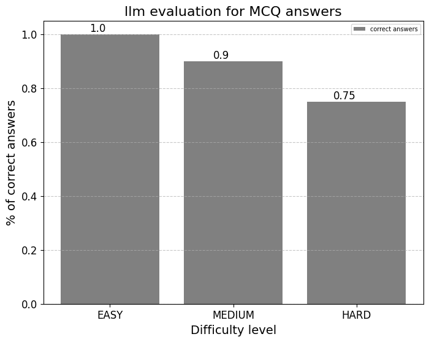

# Question Generation backend Version 0.2

## Installation
- 1: Install Ollama
https://ollama.com/download

- 2: Start ollama and download llama3 8B
https://ollama.com/library/llama3

```python
ollama pull llama3
ollama serve
```
- 3: Create a Modefile

On top of llama3 we need to create a Modelfile in ollama for each task that the llm will perform. The Modelfile is a blueprint to define system parameters and set the "system instructions". Additionally, it is included in the Modelfile the difficulty of a question optimized with few shot learning, and all the examples included follow the bloom taxonomy. 

Create a Modelfile for the Multiple Choice Question generator and the Open Question generator. Importantly, run the following commands one by one before using the script ollama_client. 

```
ollama create llama3_easy -f ./modelfile/modelfile_easy
ollama create llama3_medium -f ./modelfile/modelfile_medium
ollama create llama3_hard -f ./modelfile/modelfile_hard

ollama create llama3_easy_Open -f ./modelfile/modelfile_easy_Openquestion
ollama create llama3_medium_Open -f ./modelfile/modelfile_medium_Openquestion
ollama create llama3_hard_Open -f ./modelfile/modelfile_hard_Openquestion
ollama create llama3_evaluator -f ./modelfile/modelfile_evaluator
```

Note that for chat style models is also needed human (user) instructions. The *prompt template* folder includes a specific prompt for each level and subtask.

- 4: Execute the model

Tu run the model as an API install first: Fast API and Uvicorn.  
Secondly, run the following command to get the API up and running:

```
uvicorn main_API:app --timeout-keep-alive 500 --reload  
```

<b>Note:</b> 
In the file main_API.py we set the variable server with the ollama default local port (server = "http://127.0.0.1:11434).


Uvicorn by default will serve through the port 8000 or 8080. (i.e. http://localhost:8000)

- 5: Example of using the API from a jupyter notebook. 

<b>(Multiple choice question)</b>

```python
url =  http://localhost:8000/generate_quiz/"

input_data = {
    "text": "En el siglo XIX, los astrónomos observaron que la órbita de Urano no seguía exactamente las leyes del movimiento planetario establecidas por Isaac Newton. Urbain Le Verrier en Francia y John Couch Adams en Inglaterra realizaron cálculos independientes para predecir la existencia y la posición de un planeta más allá de Urano que podría explicar esas perturbaciones. Finalmente, en 1846, el astrónomo Johann Gottfried Galle, en Berlín, observó Neptuno cerca de la posición predicha por Le Verrier y Adams. Este descubrimiento validó la teoría de la gravitación de Newton y demostró la utilidad de las matemáticas en la predicción de fenómenos astronómicos.",
    "level": 1
}

input_json = json.dumps(input_data)
response = requests.post(url, data=input_json)
print(json.loads(response.text)) 
```

<b>(Open question)</b>

```python
{"text": "<TEXT_SOURCE>",
  "level": "<LEVEL_INTEGER>",
  "openQuestion": "True"  }
```

<b>(Answer evaluation)</b>

```python
{"text": "<TEXT_SOURCE>",
  "answer": "<ANSWER_USER>",
  "question": "<QUESTION_SOURCE>" }
```

## How well does the model work?

For evaluating the MCQ branch we followed an automatic evaluation approach. We used llama3 for checking if the “OPTION4” (True answer) is actually the correct answer of a given question (see the file *evaluator_output.txt* for the evaluation results for each answer).


As a first approach we used 10 texts (300 – 500 words length) and performed a MCQ for each level (easy, medium, hard). Total 30 MCQ (see the file  Q&A_outpput.txt for the questions and answers generated).

Note: 

To see the dataset used with the original context, questions, distractors, and scores check QA_eval_dataset.csv.

The results for answer correctness based on our dataset are shown below.


